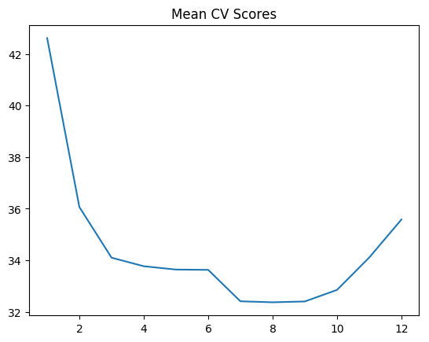
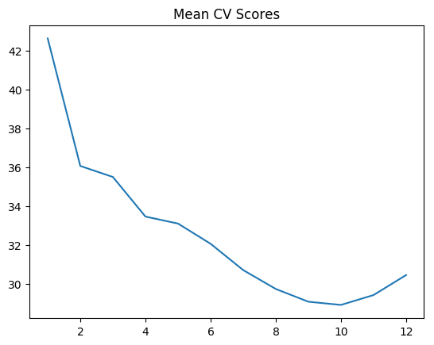

```{r}
library(leaps)
library(boot)
source('RFunctions-1.R')
df=read.csv("Boston.csv",stringsAsFactors = FALSE) # Data from MASS - SL
dim(df)
names(df) <-c("no","crimeRate","zone","indus","chasRiver","NO2","rooms","age",
              "distances","idxHighways","taxRate","teacherRatio","color","status","cost")
# Linear Regressiob fit
fit <- lm(cost~. ,data=df)
summary(fit)

# Perform a best fit
bestFit=regsubsets(cost~.,df,nvmax=14)
bfSummary=summary(bestFit)
names(bfSummary)

# Plot the Residual Sum of Squares vs number of variables 
plot(bfSummary$rss,xlab="Number of Variables",ylab="RSS",type="l")

# Plot the Adjusted R Squared vs number of variables
plot(bfSummary$adjr2,xlab="Number of Variables",ylab="Adjusted RSq",type="l")
# Find the highest R squared
a=which.max(bfSummary$adjr2)
# Mark this max point as red
points(a,bfSummary$adjr2[a], col="red",cex=2,pch=20)

# Plot the CP statistic vs Number of variables
plot(bfSummary$cp,xlab="Number of Variables",ylab="Cp",type='l')
# Find the lowest CP value
b=which.min(bfSummary$cp)
# Mark this in red
points(b,bfSummary$cp[b],col="red",cex=2,pch=20)


#  Plot the BIC value
plot(bfSummary$bic,xlab="Number of Variables",ylab="BIC",type='l')
# Find and mark the min value
c=which.min(bfSummary$bic)
points(c,bfSummary$bic[c],col="red",cex=2,pch=20)

plot(bestFit,scale="r2")
plot(bestFit,scale="adjr2")

```

```{python}
import numpy as np
import pandas as pd
import os
import matplotlib.pyplot as plt
from sklearn.model_selection import train_test_split
from sklearn.linear_model import LinearRegression
from sklearn.datasets import load_boston
from mlxtend.plotting import plot_sequential_feature_selection as plot_sfs
import matplotlib.pyplot as plt
from mlxtend.feature_selection import SequentialFeatureSelector as SFS
from sklearn.linear_model import LinearRegression


df = pd.read_csv("Boston.csv",encoding = "ISO-8859-1")
#Rename the columns
df.columns=["no","crimeRate","zone","indus","chasRiver","NO2","rooms","age",
              "distances","idxHighways","taxRate","teacherRatio","color","status","cost"]
X=df[["crimeRate","zone","indus","chasRiver","NO2","rooms","age",
              "distances","idxHighways","taxRate","teacherRatio","color","status"]]
y=df['cost']
lr = LinearRegression()

sfs = SFS(lr, 
          k_features=(1,13), 
          forward=True, 
          floating=False, 
          scoring='neg_mean_squared_error',
          cv=5)

sfs = sfs.fit(X.as_matrix(), y.as_matrix())
a=sfs.get_metric_dict()
n=[]
o=[]
for i in np.arange(1,14):
    n.append(np.mean(a[i]['cv_scores'])) 
    o.append(a[i]['std_err'])
    
    
m=np.arange(1,14)

fig1=plt.plot(m,n)
fig1=plt.title('Mean CV Scores')
fig1.figure.savefig('fig1.png', bbox_inches='tight')

fig2=plt.plot(m,o)
fig2=plt.title('Best Forward Selection (w. StdErr)')
fig2.figure.savefig('fig2.png', bbox_inches='tight')
print(pd.DataFrame.from_dict(sfs.get_metric_dict(confidence_interval=0.90)).T)
```


