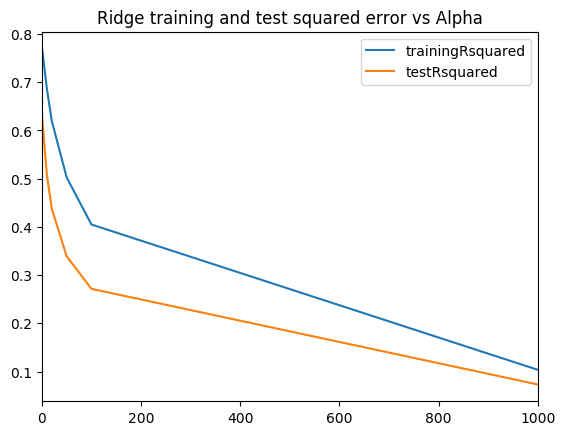
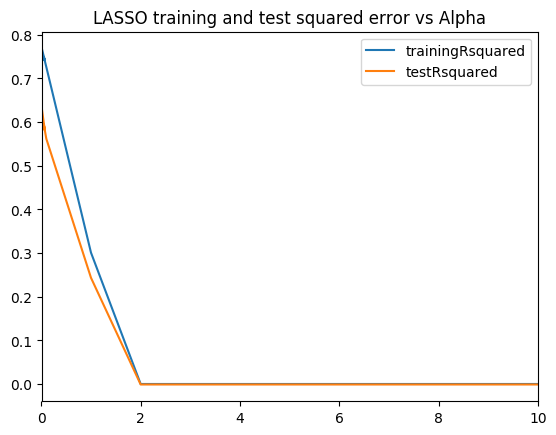
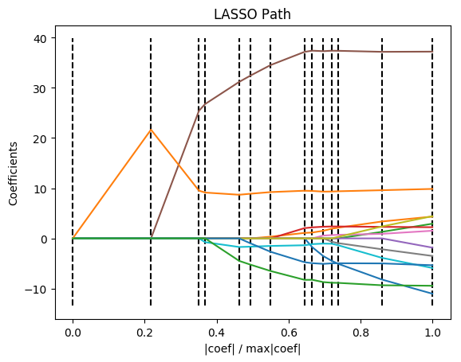

# 1 Best fit - R code

```{r fig1,cache=TRUE}
library(leaps)
library(boot)
source('RFunctions-1.R')
df=read.csv("Boston.csv",stringsAsFactors = FALSE) # Data from MASS - SL
names(df) <-c("no","crimeRate","zone","indus","charles","nox","rooms","age",
              "distances","highways","tax","teacherRatio","color","status","cost")
df1 <- df %>% dplyr::select("crimeRate","zone","indus","charles","nox","rooms","age",
                            "distances","highways","tax","teacherRatio","color","status","cost")
dim(df1)
# Linear Regressiob fit
fit <- lm(cost~. ,data=df1)
summary(fit)

# Perform a best fit
bestFit=regsubsets(cost~.,df1,nvmax=13)
bfSummary=summary(bestFit)

# Plot the Residual Sum of Squares vs number of variables 
plot(bfSummary$rss,xlab="Number of Variables",ylab="RSS",type="l")
# Gives the index of the minimum value
a=which.min(bfSummary$rss)
# Mark this in red
points(a,bfSummary$rss[a],col="red",cex=2,pch=20)

# Plot the CP statistic vs Number of variables
plot(bfSummary$cp,xlab="Number of Variables",ylab="Cp",type='l')
# Find the lowest CP value
b=which.min(bfSummary$cp)
# Mark this in red
points(b,bfSummary$cp[b],col="red",cex=2,pch=20)
# Display the set of features which provide the best fit
coef(bestFit,b)

#  Plot the BIC value
plot(bfSummary$bic,xlab="Number of Variables",ylab="BIC",type='l')
# Find and mark the min value
c=which.min(bfSummary$bic)
points(c,bfSummary$bic[c],col="red",cex=2,pch=20)

plot(bestFit,scale="r2",main="Rsquared vs No Features")
plot(bestFit,scale="Cp",main="Cp vs NoFeatures")
plot(bestFit,scale="bic",main="BIC vs Features")

```

# Best fit (Exhaustive Search ) - Python code
```{python cache=TRUE,message=FALSE,warning=FALSE}
import numpy as np
import pandas as pd
import os
import matplotlib.pyplot as plt
from sklearn.model_selection import train_test_split
from sklearn.linear_model import LinearRegression
from mlxtend.feature_selection import ExhaustiveFeatureSelector as EFS
df = pd.read_csv("Boston.csv",encoding = "ISO-8859-1")
#Rename the columns
df.columns=["no","crimeRate","zone","indus","chasRiver","NO2","rooms","age",
              "distances","idxHighways","taxRate","teacherRatio","color","status","cost"]
X=df[["crimeRate","zone","indus","chasRiver","NO2","rooms","age",
              "distances","idxHighways","taxRate","teacherRatio","color","status"]]
y=df['cost']
lr = LinearRegression()
efs1 = EFS(lr, 
           min_features=1,
           max_features=13,
           scoring='neg_mean_squared_error',
           print_progress=True,
           cv=5)


efs1 = efs1.fit(X.as_matrix(), y.as_matrix())
print('Best negtive mean squared error: %.2f' % efs1.best_score_)
print('Best subset:', efs1.best_idx_)
```


# Forward fit - R code
Forward fit in R determines that 11 features are required for the best fit. The features are shown below
```{r fig2,cache=TRUE}
df=read.csv("Boston.csv",stringsAsFactors = FALSE) # Data from MASS - SL
names(df) <-c("no","crimeRate","zone","indus","charles","nox","rooms","age",
              "distances","highways","tax","teacherRatio","color","status","cost")

# Select columns
df1 <- df %>% dplyr::select("crimeRate","zone","indus","charles","nox","rooms","age",
                     "distances","highways","tax","teacherRatio","color","status","cost")
train_idx <- trainTestSplit(df1,trainPercent=75,seed=5)
train <- df1[train_idx, ]
test <- df1[-train_idx, ]
fitFwd=regsubsets(cost~.,data=train,nvmax=13,method="forward")

valErrors=rep(NA,13)
test.mat=model.matrix(cost~.,data=test)
for(i in 1:13){
    coefi=coef(fitFwd,id=i)
    pred=test.mat[,names(coefi)]%*%coefi
    valErrors[i]=mean((test$cost-pred)^2)
}

plot(valErrors,xlab="Number of Variables",ylab="Validation Error",type="l")
# Gives the index of the minimum value
a<-which.min(valErrors)
print(a)
points(c,valErrors[a],col="blue",cex=2,pch=20)

#Print the 11 ccoefficients
coefi=coef(fitFwd,id=i)
coefi
```


```{r fig3,cache=TRUE}
library(dplyr)
df=read.csv("Boston.csv",stringsAsFactors = FALSE) # Data from MASS - SL
names(df) <-c("no","crimeRate","zone","indus","charles","nox","rooms","age",
              "distances","highways","tax","teacherRatio","color","status","cost")

# Select columns
df1 <- df %>% dplyr::select("crimeRate","zone","indus","charles","nox","rooms","age",
                     "distances","highways","tax","teacherRatio","color","status","cost")

set.seed(6)
# Set max number of features
nvmax<-13
cvError <- NULL
# Loop through each features
for(i in 1:nvmax){
    # Set no of folds
    noFolds=5
    # Create the rows which fall into different folds from 1..noFolds
    folds = sample(1:noFolds, nrow(df1), replace=TRUE) 
    cv<-0
    for(j in 1:noFolds){
        # The training is all rows for which the row is != j 
        train <- df1[folds!=j,]
        # The rows which have j as the index become the test set
        test <- df1[folds==j,]
        # Create a forward fitting model for this
        fitFwd=regsubsets(cost~.,data=train,nvmax=13,method="forward")
        # Select the number of features and get the feature coefficients
        coefi=coef(fitFwd,id=i)
        #Get the value of the test data
        test.mat=model.matrix(cost~.,data=test)
        # Multiply the tes data with teh fitted coefficients to get the predicted value
        # pred = b0 + b1x1+b2x2... b13x13
        pred=test.mat[,names(coefi)]%*%coefi
        # Compute mean squared error
        rss=mean((test$cost - pred)^2)
        cv=cv+rss
    }
    # Compute the average of MSE for K folds for number of features 'i'
    cvError[i]=cv/noFolds
}
a <- seq(1,13)
d <- as.data.frame(t(rbind(a,cvError)))
names(d) <- c("Features","CVError")
ggplot(d,aes(x=Features,y=CVError),color="blue") + geom_point() + geom_line(color="blue") +
    xlab("No of features") + ylab("Cross Validation Error") +
    ggtitle("Forward Selection - Cross Valdation Error vs No of Features")

# This gives the index of the minimum value
a=which.min(cvError)
print(a)
#Print the 13 coefficients of these features
coefi=coef(fitFwd,id=a)
coefi


```

# Forward fit - Python code
The Cross validation error for SFS in Sklearn is negative, possibly because it computes
the 'neg_mean_squared_error'
```{python }
import numpy as np
import pandas as pd
import os
import matplotlib.pyplot as plt
from sklearn.model_selection import train_test_split
from sklearn.linear_model import LinearRegression
from sklearn.datasets import load_boston
from mlxtend.plotting import plot_sequential_feature_selection as plot_sfs
import matplotlib.pyplot as plt
from mlxtend.feature_selection import SequentialFeatureSelector as SFS
from sklearn.linear_model import LinearRegression


df = pd.read_csv("Boston.csv",encoding = "ISO-8859-1")
#Rename the columns
df.columns=["no","crimeRate","zone","indus","chasRiver","NO2","rooms","age",
              "distances","idxHighways","taxRate","teacherRatio","color","status","cost"]
X=df[["crimeRate","zone","indus","chasRiver","NO2","rooms","age",
              "distances","idxHighways","taxRate","teacherRatio","color","status"]]
y=df['cost']
lr = LinearRegression()

sfs = SFS(lr, 
          k_features=(1,13), 
          forward=True, 
          floating=False, 
          scoring='neg_mean_squared_error',
          cv=5)

sfs = sfs.fit(X.as_matrix(), y.as_matrix())
a=sfs.get_metric_dict()
n=[]
o=[]
for i in np.arange(1,13):
    n.append(-np.mean(a[i]['cv_scores'])) 
   
    
    
m=np.arange(1,13)
# Get the index of the minimum CV score


fig1=plt.plot(m,n)
fig1=plt.title('Mean CV Scores')
fig1.figure.savefig('fig1.png', bbox_inches='tight')

print(pd.DataFrame.from_dict(sfs.get_metric_dict(confidence_interval=0.90)).T)

idx = np.argmin(n)
print "No of features=",idx
#Get the features indices for the best forward fit and convert to list
b=list(a[idx]['feature_idx'])
print(b)

print("#################################################################################")
# Index the column names. 
# Features from forward fit
print("Features selected in forward fit")
print(X.columns[b])
```


# Backward fit - R code
```{r fig4,cache=TRUE}
library(dplyr)
df=read.csv("Boston.csv",stringsAsFactors = FALSE) # Data from MASS - SL
names(df) <-c("no","crimeRate","zone","indus","charles","nox","rooms","age",
              "distances","highways","tax","teacherRatio","color","status","cost")

# Select columns
df1 <- df %>% dplyr::select("crimeRate","zone","indus","charles","nox","rooms","age",
                     "distances","highways","tax","teacherRatio","color","status","cost")

set.seed(6)
# Set max number of features
nvmax<-13
cvError <- NULL
# Loop through each features
for(i in 1:nvmax){
    # Set no of folds
    noFolds=5
    # Create the rows which fall into different folds from 1..noFolds
    folds = sample(1:noFolds, nrow(df1), replace=TRUE) 
    cv<-0
    for(j in 1:noFolds){
        # The training is all rows for which the row is != j 
        train <- df1[folds!=j,]
        # The rows which have j as the index become the test set
        test <- df1[folds==j,]
        # Create a backward fitting model for this
        fitFwd=regsubsets(cost~.,data=train,nvmax=13,method="backward")
        # Select the number of features and get the feature coefficients
        coefi=coef(fitFwd,id=i)
        #Get the value of the test data
        test.mat=model.matrix(cost~.,data=test)
        # Multiply the tes data with teh fitted coefficients to get the predicted value
        # pred = b0 + b1x1+b2x2... b13x13
        pred=test.mat[,names(coefi)]%*%coefi
        # Compute mean squared error
        rss=mean((test$cost - pred)^2)
        cv=cv+rss
    }
    # Compute the average of MSE for K folds for number of features 'i'
    cvError[i]=cv/noFolds
}
a <- seq(1,13)
d <- as.data.frame(t(rbind(a,cvError)))
names(d) <- c("Features","CVError")
ggplot(d,aes(x=Features,y=CVError),color="blue") + geom_point() + geom_line(color="blue") +
    xlab("No of features") + ylab("Cross Validation Error") +
    ggtitle("Backward Selection - Cross Valdation Error vs No of Features")

# This gives the index of the minimum value
a=which.min(cvError)
print(a)
#Print the 13 coefficients of these features
coefi=coef(fitFwd,id=a)
coefi

```


## Backward fit - Python code

```{python }
import numpy as np
import pandas as pd
import os
import matplotlib.pyplot as plt
from sklearn.model_selection import train_test_split
from sklearn.linear_model import LinearRegression
from mlxtend.plotting import plot_sequential_feature_selection as plot_sfs
import matplotlib.pyplot as plt
from mlxtend.feature_selection import SequentialFeatureSelector as SFS
from sklearn.linear_model import LinearRegression

df = pd.read_csv("Boston.csv",encoding = "ISO-8859-1")
#Rename the columns
df.columns=["no","crimeRate","zone","indus","chasRiver","NO2","rooms","age",
              "distances","idxHighways","taxRate","teacherRatio","color","status","cost"]
X=df[["crimeRate","zone","indus","chasRiver","NO2","rooms","age",
              "distances","idxHighways","taxRate","teacherRatio","color","status"]]
y=df['cost']
lr = LinearRegression()

sfs = SFS(lr, 
          k_features=(1,13), 
          forward=False, 
          floating=False, 
          scoring='neg_mean_squared_error',
          cv=5)

sfs = sfs.fit(X.as_matrix(), y.as_matrix())
a=sfs.get_metric_dict()
n=[]
o=[]
for i in np.arange(1,13):
    n.append(-np.mean(a[i]['cv_scores'])) 
   
    
    
m=np.arange(1,13)
# Get the index of the minimum CV score


fig2=plt.plot(m,n)
fig2=plt.title('Mean CV Scores')
fig2.figure.savefig('fig2.png', bbox_inches='tight')

print(pd.DataFrame.from_dict(sfs.get_metric_dict(confidence_interval=0.90)).T)

idx = np.argmin(n)
print "No of features=",idx
#Get the features indices for the best forward fit and convert to list
b=list(a[idx]['feature_idx'])
print(b)

print("#################################################################################")
# Index the column names. 
# Features from backward fit
print("Features selected in bacward fit")
print(X.columns[b])


```


# SFFS - Python
```{python }
import numpy as np
import pandas as pd
import os
import matplotlib.pyplot as plt
from sklearn.model_selection import train_test_split
from sklearn.linear_model import LinearRegression
from sklearn.datasets import load_boston
from mlxtend.plotting import plot_sequential_feature_selection as plot_sfs
import matplotlib.pyplot as plt
from mlxtend.feature_selection import SequentialFeatureSelector as SFS
from sklearn.linear_model import LinearRegression


df = pd.read_csv("Boston.csv",encoding = "ISO-8859-1")
#Rename the columns
df.columns=["no","crimeRate","zone","indus","chasRiver","NO2","rooms","age",
              "distances","idxHighways","taxRate","teacherRatio","color","status","cost"]
X=df[["crimeRate","zone","indus","chasRiver","NO2","rooms","age",
              "distances","idxHighways","taxRate","teacherRatio","color","status"]]
y=df['cost']
lr = LinearRegression()

sffs = SFS(lr, 
          k_features=(1,13), 
          forward=True, 
          floating=True, 
          scoring='neg_mean_squared_error',
          cv=5)

sffs = sffs.fit(X.as_matrix(), y.as_matrix())
a=sffs.get_metric_dict()
n=[]
o=[]
for i in np.arange(1,13):
    n.append(-np.mean(a[i]['cv_scores'])) 
   
    
    
m=np.arange(1,13)
# Get the index of the minimum CV score


fig3=plt.plot(m,n)
fig3=plt.title('Mean CV Scores')
fig3.figure.savefig('fig3.png', bbox_inches='tight')

print(pd.DataFrame.from_dict(sffs.get_metric_dict(confidence_interval=0.90)).T)

idx = np.argmin(n)
print "No of features=",idx
#Get the features indices for the best forward floating fit and convert to list
b=list(a[idx]['feature_idx'])
print(b)

print("#################################################################################")
# Index the column names. 
# Features from forward fit
print("Features selected in forward fit")
print(X.columns[b])
```


```{python}
import numpy as np
import pandas as pd
import os
import matplotlib.pyplot as plt
from sklearn.model_selection import train_test_split
from sklearn.linear_model import LinearRegression
from sklearn.datasets import load_boston
from mlxtend.plotting import plot_sequential_feature_selection as plot_sfs
import matplotlib.pyplot as plt
from mlxtend.feature_selection import SequentialFeatureSelector as SFS
from sklearn.linear_model import LinearRegression


df = pd.read_csv("Boston.csv",encoding = "ISO-8859-1")
#Rename the columns
df.columns=["no","crimeRate","zone","indus","chasRiver","NO2","rooms","age",
              "distances","idxHighways","taxRate","teacherRatio","color","status","cost"]
X=df[["crimeRate","zone","indus","chasRiver","NO2","rooms","age",
              "distances","idxHighways","taxRate","teacherRatio","color","status"]]
y=df['cost']
lr = LinearRegression()

sffs = SFS(lr, 
          k_features=(1,13), 
          forward=False, 
          floating=True, 
          scoring='neg_mean_squared_error',
          cv=5)

sffs = sffs.fit(X.as_matrix(), y.as_matrix())
a=sffs.get_metric_dict()
n=[]
o=[]
for i in np.arange(1,13):
    n.append(-np.mean(a[i]['cv_scores'])) 
   
    
    
m=np.arange(1,13)
# Get the index of the minimum CV score


fig4=plt.plot(m,n)
fig4=plt.title('Mean CV Scores')
fig4.figure.savefig('fig4.png', bbox_inches='tight')

print(pd.DataFrame.from_dict(sffs.get_metric_dict(confidence_interval=0.90)).T)

idx = np.argmin(n)
print "No of features=",idx
#Get the features indices for the best backward floating fit and convert to list
b=list(a[idx]['feature_idx'])
print(b)

print("#################################################################################")
# Index the column names. 
# Features from forward fit
print("Features selected in backward floating fit")
print(X.columns[b])
```


```{r}
library(glmnet)
library(dplyr)
df=read.csv("Boston.csv",stringsAsFactors = FALSE) # Data from MASS - SL
names(df) <-c("no","crimeRate","zone","indus","charles","nox","rooms","age",
              "distances","highways","tax","teacherRatio","color","status","cost")
df1 <- df %>% dplyr::select("crimeRate","zone","indus","charles","nox","rooms","age",
                            "distances","highways","tax","teacherRatio","color","status","cost")

X=model.matrix(cost~.,df1)[,-1]
y=df1$cost
fitRidge <-glmnet(X,y,alpha=0)
plot(fitRidge,xvar="lambda",label=TRUE)
cvRidge=cv.glmnet(X,y,alpha=0)
plot(cvRidge)

```


```{python}
import numpy as np
import pandas as pd
import os
import matplotlib.pyplot as plt
from sklearn.model_selection import train_test_split


df = pd.read_csv("Boston.csv",encoding = "ISO-8859-1")
#Rename the columns
df.columns=["no","crimeRate","zone","indus","chasRiver","NO2","rooms","age",
              "distances","idxHighways","taxRate","teacherRatio","color","status","cost"]
X=df[["crimeRate","zone","indus","chasRiver","NO2","rooms","age",
              "distances","idxHighways","taxRate","teacherRatio","color","status"]]
y=df['cost']
from sklearn.preprocessing import MinMaxScaler
scaler = MinMaxScaler()

from sklearn.linear_model import Ridge
X_train, X_test, y_train, y_test = train_test_split(X, y,
                                                   random_state = 0)

X_train_scaled = scaler.fit_transform(X_train)
X_test_scaled = scaler.transform(X_test)

linridge = Ridge(alpha=20.0).fit(X_train_scaled, y_train)

print('Crime dataset')
print('ridge regression linear model intercept: {}'
     .format(linridge.intercept_))
print('ridge regression linear model coeff:\n{}'
     .format(linridge.coef_))
print('R-squared score (training): {:.3f}'
     .format(linridge.score(X_train_scaled, y_train)))
print('R-squared score (test): {:.3f}'
     .format(linridge.score(X_test_scaled, y_test)))
print('Number of non-zero features: {}'
     .format(np.sum(linridge.coef_ != 0)))

trainingRsquared=[]
testRsquared=[]
print('Ridge regression: effect of alpha regularization parameter\n')
for this_alpha in [0.001,.01,.1,0, 1, 10, 20, 50, 100, 1000]:
    linridge = Ridge(alpha = this_alpha).fit(X_train_scaled, y_train)
    r2_train = linridge.score(X_train_scaled, y_train)
    r2_test = linridge.score(X_test_scaled, y_test)
    num_coeff_bigger = np.sum(abs(linridge.coef_) > 1.0)
    trainingRsquared.append(r2_train)
    testRsquared.append(r2_test)
alpha=[0.001,.01,.1,0, 1, 10, 20, 50, 100, 1000]    
trainingRsquared=pd.DataFrame(trainingRsquared,index=alpha)
testRsquared=pd.DataFrame(testRsquared,index=alpha)

df3=pd.concat([trainingRsquared,testRsquared],axis=1)
df3.columns=['trainingRsquared','testRsquared']

fig5=df3.plot()
fig5.figure.savefig('fig5.png', bbox_inches='tight')

from sklearn import linear_model
# #############################################################################
# Compute paths

n_alphas = 200
alphas = np.logspace(0, 8, n_alphas)

coefs = []
for a in alphas:
    ridge = linear_model.Ridge(alpha=a, fit_intercept=False)
    ridge.fit(X_train_scaled, y_train)
    coefs.append(ridge.coef_)

# #############################################################################
# Display results

ax = plt.gca()

fig6=ax.plot(alphas, coefs)
fig6=ax.set_xscale('log')
fig6=ax.set_xlim(ax.get_xlim()[::-1])  # reverse axis
fig6=plt.xlabel('alpha')
fig6=plt.ylabel('weights')
fig6=plt.title('Ridge coefficients as a function of the regularization')
fig6=plt.axis('tight')
plt.savefig('fig6.png', bbox_inches='tight')


```




```{r}
library(glmnet)
library(dplyr)
df=read.csv("Boston.csv",stringsAsFactors = FALSE) # Data from MASS - SL
names(df) <-c("no","crimeRate","zone","indus","charles","nox","rooms","age",
              "distances","highways","tax","teacherRatio","color","status","cost")
df1 <- df %>% dplyr::select("crimeRate","zone","indus","charles","nox","rooms","age",
                            "distances","highways","tax","teacherRatio","color","status","cost")

X=model.matrix(cost~.,df1)[,-1]
y=df1$cost
fitLasso <- glmnet(X,y)
plot(fitLasso,xvar="lambda",label=TRUE)
cvLasso=cv.glmnet(X,y,alpha=0)
plot(cvLasso)
```


```{python}
import numpy as np
import pandas as pd
import os
import matplotlib.pyplot as plt
from sklearn.model_selection import train_test_split
from sklearn.linear_model import Lasso
from sklearn.preprocessing import MinMaxScaler
from sklearn import linear_model

scaler = MinMaxScaler()
df = pd.read_csv("Boston.csv",encoding = "ISO-8859-1")
#Rename the columns
df.columns=["no","crimeRate","zone","indus","chasRiver","NO2","rooms","age",
              "distances","idxHighways","taxRate","teacherRatio","color","status","cost"]
X=df[["crimeRate","zone","indus","chasRiver","NO2","rooms","age",
              "distances","idxHighways","taxRate","teacherRatio","color","status"]]
y=df['cost']
X_train, X_test, y_train, y_test = train_test_split(X, y,
                                                   random_state = 0)

X_train_scaled = scaler.fit_transform(X_train)
X_test_scaled = scaler.transform(X_test)

linlasso = Lasso(alpha=0.1, max_iter = 10).fit(X_train_scaled, y_train)


print('lasso regression linear model intercept: {}'
     .format(linlasso.intercept_))
print('lasso regression linear model coeff:\n{}'
     .format(linlasso.coef_))
print('Non-zero features: {}'
     .format(np.sum(linlasso.coef_ != 0)))
print('R-squared score (training): {:.3f}'
     .format(linlasso.score(X_train_scaled, y_train)))
print('R-squared score (test): {:.3f}\n'
     .format(linlasso.score(X_test_scaled, y_test)))
print('Features with non-zero weight (sorted by absolute magnitude):')

for e in sorted (list(zip(list(X), linlasso.coef_)),
                key = lambda e: -abs(e[1])):
    if e[1] != 0:
        print('\t{}, {:.3f}'.format(e[0], e[1]))
        

print('Lasso regression: effect of alpha regularization\n\
parameter on number of features kept in final model\n')

trainingRsquared=[]
testRsquared=[]
#for alpha in [0.01,0.05,0.1, 1, 2, 3, 5, 10, 20, 50]:
for alpha in [0.01,0.07,0.05, 0.1, 1,2, 3, 5, 10]:
    linlasso = Lasso(alpha, max_iter = 100000).fit(X_train_scaled, y_train)
    r2_train = linlasso.score(X_train_scaled, y_train)
    r2_test = linlasso.score(X_test_scaled, y_test)
    trainingRsquared.append(r2_train)
    testRsquared.append(r2_test)
    
alpha=[0.01,0.07,0.05, 0.1, 1,2, 3, 5, 10]    
#alpha=[0.01,0.05,0.1, 1, 2, 3, 5, 10, 20, 50]
trainingRsquared=pd.DataFrame(trainingRsquared,index=alpha)
testRsquared=pd.DataFrame(testRsquared,index=alpha)

df3=pd.concat([trainingRsquared,testRsquared],axis=1)
df3.columns=['trainingRsquared','testRsquared']

df3.plot()
plt.savefig('fig7.png', bbox_inches='tight')


print("Computing regularization path using the LARS ...")
alphas, _, coefs = linear_model.lars_path(X_train_scaled, y_train, method='lasso', verbose=True)

xx = np.sum(np.abs(coefs.T), axis=1)
xx /= xx[-1]
print(xx)
plt.plot(xx, coefs.T)
plt.xlim(xmax = 1.0, xmin = 0.0)
ymin, ymax = plt.ylim()
plt.vlines(xx, ymin, ymax, linestyle='dashed')
plt.xlabel('|coef| / max|coef|')
plt.ylabel('Coefficients')
plt.title('LASSO Path')
plt.axis('tight')
plt.savefig('fig8.png', bbox_inches='tight')
```


